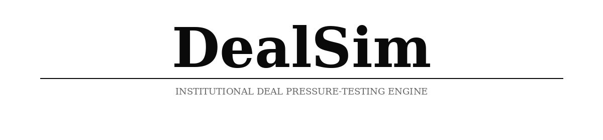

# DealSim

<div align="center">

</div>

DealSim：机构级交易压力测试引擎
<em>「给定这笔交易，在真实的资本严审下，什么会首先崩溃？」</em>


[English](./README.md) | [中文文档](./README-ZH.md)

</div>

## ⚡ 项目概述

**DealSim** 是一款机构级的交易压力测试引擎，旨在 GP 进入投审会（IC）、创始人会见领投人或交易团队向 LP 咨询委员会汇报之前，模拟真实的对抗性资本审查。

现代金融的缺口不在于信息，而在于**早期应用结构化的对抗性审查**。DealSim 通过以下功能填补了这一空白：
- **交易主张映射 (Claim Mapping)**：将交易的核心逻辑提取为可验证的图谱。
- **触发对抗性审计 (Adversarial Audits)**：部署专业的「投资原型」(如保守建制派、增长乐观派、财务工程师) 来压力测试您的假设。
- **识别脆弱性 (Fragility Identification)**：通过 5 阶段模拟投审会 (IC) 循环，发现「什么会首先崩溃」。

---

### 💡 简单通俗的解释

*DealSim* 是一款在投资项目会见真实投资者之前进行压力测试的软件工具。

**问题所在：** 当基金经理或创始人走进投审会 (IC) 或投资者会议时，通常才是一笔交易第一次受到真正的挑战。此时，数周的工作和真实的信誉都已经处于风险之中。在这么晚的阶段才发现漏洞，既昂贵又令人尴尬。

**它的作用：** 您上传您的融资演示文稿 (Pitch Deck)、财务模型和假设备忘录。系统会将交易分解为您提出的每一项具体主张——比如“我们的留存率是 120%”或“我们将以 12 倍的估值退出”。然后，它会让这些主张通过 50-100 个模拟的资本分配者（包括持怀疑态度的 VC、保守的 PE 合伙人、家族办公室、合规审查员等），每个人都应用其现实世界的决策标准。他们会在五个结构化的阶段攻击您的主张，本质上是模拟真实的投审会流程。

**输出结果：** 是一份干净的单一报告，告诉您：哪些主张会首先崩溃，最常见的反对意见是什么，哪些信息缺口会被标记，哪些类型的投资者会通过 vs. 继续方案，以及——至关重要的一点——究竟什么样的证据或变化可以将“否”转化为“也许”。

**一句话的核心价值：** 它是您交易的排练室，在您走进那个真正重要的房间之前，告诉您在哪里会“阵亡”。

---

## 🔄 DealSim 5 阶段审计流程

1. **初步审查 (First Look)**：对交易结构进行高层次评估，识别表面的红旗风险。
2. **全套资料评审 (Full Pack Review)**：对投资建议书 (Memo) 和财务模型进行详尽检查。
3. **交叉质询 (Cross-Examination)**：由持有冲突授权（如增长 vs 资本保值）的 Agent 进行深度对抗性互动。
4. **尽调重点识别 (Diligence Surfacing)**：合成文档中*未提及*但*应当具备*的关键信息缺口。
5. **最终裁决 (Final Verdict)**：基于累积的压力测试结果，给出明确的 GO/NO-GO 投资建议。


## 🚀 快速开始

### 1. 前置要求
- **Node.js** 18+
- **Python** 3.11+
- **uv** (快速 Python 包管理器)

### 2. 配置环境
```bash
cp .env.example .env
# 填写您的 LLM_API_KEY (兼容 OpenAI 格式) 和 ZEP_API_KEY
```

### 3. 部署
```bash
# 安装所有依赖
npm run setup:all

# 启动本地开发服务
npm run dev
```

## 📄 架构与投资原型 (Archetypes)

DealSim 从传统的「性格驱动型」AI 转向了**「授权驱动型」(Mandate-driven) AI**。投审会中的每个人设都受特定投资授权的约束：
- **保守建制派 (The Skeptical Institutionalist)**：关注下行保护和资本保值。
- **财务工程师 (The Financial Engineer)**：痴迷于 EBITDA 利润率和退出倍数。
- **困境反转专家 (The Distressed Specialist)**：寻找交易崩溃点以寻找入场价值。

## 📄 致谢

DealSim 的仿真引擎由 **[OASIS (Open Agent Social Interaction Simulations)](https://github.com/camel-ai/oasis)** 驱动。我们由衷感谢 CAMEL-AI 团队的开源贡献。

---
## 📄 许可证

由 **Nursan Omarov** 开发。

本软件已开源。
- **允许**：个人使用、商业用途、修改和分发。
- **商业化**：您可以根据 GNU AGPLv3 许可证条款，自由地对基于本软件构建的服务或产品进行商业化。

有关完整的法律文本，请参阅 [LICENSE](LICENSE) 文件。

---
© 2026 Nursan Omarov. DealSim - 机构级交易压力测试引擎.
